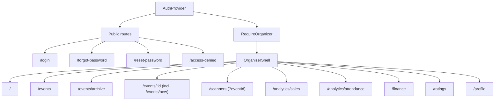
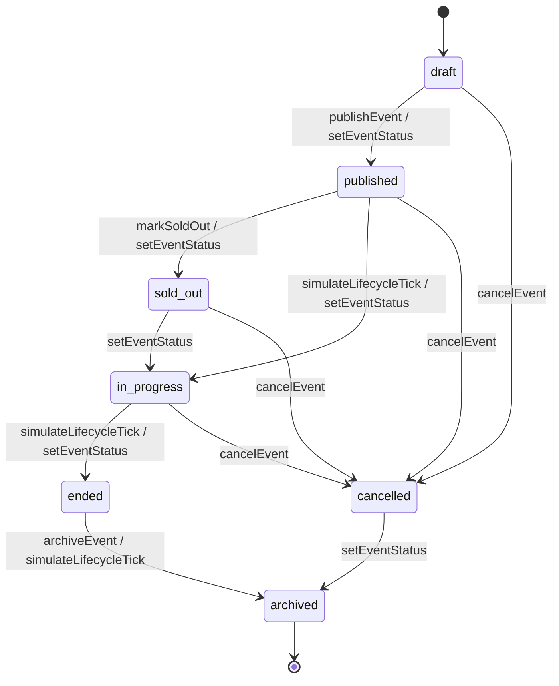
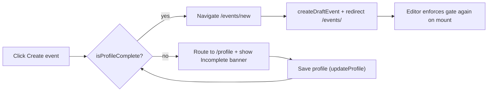
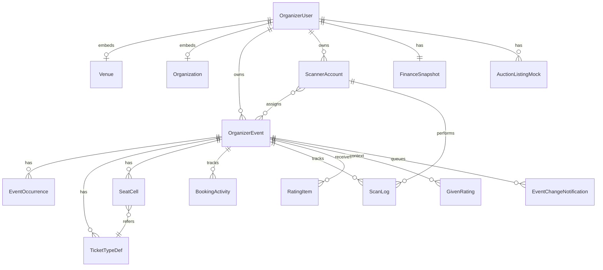

# MyTicket — Organizer Dashboard Flow

> **Type:** Organizer Dashboard (Standalone)
> **URL:** `organizer.myticket.com`
> **Users:** Organizer only
> **Shared Flows:** See `myticket_shared_flow.md` for authentication, notifications, payment, localization, and ticket format
> **Master Reference:** `myticket_platform_flow.md`
> **Repo:** `organizer/` (this folder)
> **Last Updated:** April 2026 (synchronized with codebase)

---

## 1. Overview

The Organizer Dashboard is a standalone web application for event organizers. It provides comprehensive tools for **profile management**, **event creation and management** (grid / section / free layouts, recurring schedules, per-seat ticket pricing), **scanner accounts and assignments**, **sales / bookings / attendance / financial analytics**, **post-event archive with media**, and **ratings**. Only users with the **Organizer** role can access this dashboard.

Marketplace discovery, real-time chat, and Talent/Vendor hiring live on the **main website** (`myticket.com/marketplace`). Only outcomes of those flows that are owned by the organizer (e.g. ratings given to talents and vendors, events publicly associating talents/vendors) flow back here as data.

### 1.1 Current implementation surface

The repository at `organizer/` is a **client-only mock** of the dashboard. There is **no backend** yet — every "service" call reads/writes a snapshot of state held in `localStorage`. This document describes both the product flow and the implementation surface so that a future database can be built directly from it.

| Layer | Choice |
|---|---|
| Framework | React 19 + Vite 8 + TypeScript |
| Routing | `react-router-dom@7` |
| Styling | Tailwind CSS 4 + custom design tokens (`src/index.css`) |
| Charts | Recharts 3 + shadcn-style wrappers (`src/components/ui/chart.tsx`) |
| State / persistence | `localStorage` snapshot in `src/services/organizerStore.ts`; auth in `sessionStorage` |
| Seed | `src/data/mockOrganizerData.ts` (`SEED_STATE`) |
| Types | Single-file domain in `src/types/domain.ts` |

---

## 2. Routing & Page Map

Routes are declared in [`src/App.tsx`](src/App.tsx). All non-public routes are nested under `RequireOrganizer` → `OrganizerShell`.

| Route | Component | Primary services consumed |
|---|---|---|
| `/login` | `LoginPage` | `useAuth().signIn`, `useAuth().signInGoogleMock` |
| `/forgot-password` | `ForgotPasswordPage` | (UI only — see shared flow) |
| `/reset-password` | `ResetPasswordPage` | (UI only — see shared flow) |
| `/access-denied` | `AccessDeniedPage` | (static) |
| `/` | `HomePage` | `getSalesSummary`, `getBookingVelocity`, `listScanLogs` |
| `/events` | `EventListPage` | `listEvents`, `getProfile`, `isProfileComplete`, `archiveEvent`, `duplicateEvent`, `setEventStatus`, `simulateLifecycleTick` |
| `/events/archive` | `EventArchivePage` | `listEvents`, `duplicateEvent` |
| `/events/:id` (incl. `/events/new` resolved as `id === 'new'`) | `EventEditorPage` | `getEvent`, `createDraftEvent`, `patchEvent`, `publishEvent`, `setEventStatus`, `simulateLifecycleTick`, `cancelOccurrence`, `appendChangeLog`, `validateFreeLayoutTotals`, `listEventNotifications`, `buildSeatsFromGrid`, `getProfile`, `isProfileComplete` |
| `/scanners` (`?eventId=...` deeplink) | `ScannerManagementPage` | `listScanners`, `listScanLogs`, `createScanner`, `upsertScanner`, `deleteScanner`, `assignScanner`, `listEvents` |
| `/analytics/sales` | `SalesAnalyticsPage` | `getSalesSummary`, `getBookingVelocity`, `getSalesByEvent`, `getTicketTypeDistribution`, `getAuctionActivity` |
| `/analytics/attendance` | `AttendancePage` | `getAttendanceByEvent`, `listEvents` |
| `/finance` | `FinancialOverviewPage` | `getFinance` |
| `/ratings` | `RatingsPage` | `listRatings`, `listGivenRatings`, `getRatingsAggregate` |
| `/profile` | `ProfilePage` | `getProfile`, `updateProfile`, `isProfileComplete` |
| `*` | `Navigate to="/"` | — |

`OrganizerShell` ([`src/layouts/OrganizerShell.tsx`](src/layouts/OrganizerShell.tsx)) provides the persistent header + side nav from [`src/config/nav.ts`](src/config/nav.ts) (`NAV_MAIN`).

---

## 3. Authentication & Authorization

The Organizer Dashboard has its own login page. **Self-registration is not available** — Organizer accounts are created through the role application flow on the main website (approved by Admin). See `myticket_shared_flow.md` Section 3.6 for the production login flow and Section 3.7 for password reset.

### 3.1 Production rules
- Email/password and Google Social Login.
- Only users with the **Organizer** role can sign in. Non-organizer credentials redirect to `/access-denied`.
- Forgot/Reset password flows are shared (see shared flow).

### 3.2 Current implementation (demo)
- `AuthProvider` ([`src/contexts/AuthContext.tsx`](src/contexts/AuthContext.tsx)) holds `SessionUser | null` in React state, mirrored into `sessionStorage` under key `myticket_organizer_session_v1`.
- Demo role resolver (`resolveDemoRole`):
  - `organizer@myticket.demo` → `organizer`
  - any email containing `+organizer` → `organizer`
  - any email containing `attendee` or `+buyer` → `attendee` (rejected here)
  - otherwise → invalid
- `RequireOrganizer` ([`src/components/auth/RequireOrganizer.tsx`](src/components/auth/RequireOrganizer.tsx)) is the route guard:
  - no user → redirect to `/login` (preserves `from` in `location.state`)
  - role !== `organizer` → redirect to `/access-denied`
- `signInGoogleMock` instantly sets a fixed demo organizer session.

### 3.3 `SessionUser`
```ts
type SessionUser = { email: string; name: string; role: 'organizer' | 'attendee' };
```

> Production replacement: replace `AuthProvider` with a real OAuth/JWT or session-cookie integration; keep `RequireOrganizer` and `useAuth` API stable to minimize page churn.

---

## 4. Dashboard Home

`HomePage` ([`src/pages/dashboard/HomePage.tsx`](src/pages/dashboard/HomePage.tsx)) provides an at-a-glance summary.

- **KPI tiles:** total events, tickets sold, gross revenue, upcoming live count — backed by `getSalesSummary()` (`{ totalTickets, totalRevenue, upcoming, eventCount }`).
- **Quick actions:** `Create event` (→ `/events/new`), `View my events` (→ `/events`), `Manage scanners` (→ `/scanners`).
- **Recent bookings:** last 12 entries from `getBookingVelocity()` (sorted by `at` desc).
- **Recent scanner activity:** last 5 entries from `listScanLogs()`.
- **Marketplace card:** static external link to `https://myticket.com/marketplace` — Marketplace lives on the main site (see Section 15).

---

## 5. Organizer Profile Management

`ProfilePage` ([`src/pages/profile/ProfilePage.tsx`](src/pages/profile/ProfilePage.tsx)) groups the organizer profile into four tabs: **Info & contact**, **Venue**, **Organization**, **Documents & media**. The persisted shape is `OrganizerUser` (Section 16.1).

### 5.1 Required for "complete profile"
The hard rule used to gate Create / Publish event lives in `isProfileComplete` ([`src/services/profileService.ts`](src/services/profileService.ts)). All of the following must be true:

| Predicate | Rule |
|---|---|
| `displayName` | length ≥ 2 (trimmed) |
| `bio` | length ≥ 30 (trimmed) |
| `phone` | length ≥ 8 (trimmed) — formatted via `SaudiPhoneInput` (`+966` prefix locked, local digits only) |
| `city` | length ≥ 2 (trimmed) |
| `organizationDocument` | truthy (filename or URL) |
| `gallery` | length ≥ 1 |
| `venue` | present |
| `venue.capacity` | > 0 |
| `venue.facilities` | length ≥ 1 |
| `organization` | present |
| `organization.previousEvents` | length ≥ 1 |

If the rule fails, the dashboard surfaces:
- A coral banner on `/events` and `/profile`
- The "Create event" button becomes "Complete profile first" and routes to `/profile`
- `EventEditorPage` redirects to `/profile`

### 5.2 Field reference (per tab)

**Info & contact**
- `displayName` (text, required)
- `phone` (Saudi phone, `+966` + local digits)
- `city` — coupled with derived `regionId` UI selection from [`src/lib/saudiLocations.ts`](src/lib/saudiLocations.ts) (`SAUDI_REGIONS`, `SAUDI_CITIES_BY_REGION`, `findRegionIdForCityName`, `getCitiesForRegion`)
- `logoUrl` (file ref or URL — demo encodes uploaded file as `file:<name>`)
- `bio` (text, ≥ 30)

**Venue** (`OrganizerUser.venue`)
- `name`, `address`, `city`, `capacity` (int | null), `facilities[]` (tag-style add/remove)

**Organization** (`OrganizerUser.organization`)
- `website`, `instagram`, `twitter`, `tiktok`, `typicalEventDurationHours`, `previousEvents[]`, `categories[]`

**Documents & media**
- `organizationDocument` (required; demo encodes as `document:<name>`)
- `gallery[]` (≥ 1; demo encodes each entry as `file:<name>:<id>`; previews via `URL.createObjectURL`)

### 5.3 Saudi locations
The picker covers 13 regions and ~80 cities — full list in [`src/lib/saudiLocations.ts`](src/lib/saudiLocations.ts). City selection is region-scoped; switching the region clears the dependent city.

---

## 6. Event Creation & Management

Events live in `OrganizerEvent` (Section 16.2). The dashboard exposes them through `EventListPage`, `EventEditorPage`, and `EventArchivePage`.

### 6.1 Event creation flow (`/events/new`)
1. `EventEditorPage` reads `id` from the URL. When `id === 'new'`:
   - It bootstraps a draft via `createDraftEvent()` (defaults below) and replace-navigates to `/events/<newId>`.
2. The page then enforces `isProfileComplete` — fails → redirect to `/profile`.
3. The organizer fills in **Basics** (title, description, category, venue, city, `startsAt`, `endsAt`).
4. **Layout type** is selected:
   - `grid` — cinema-style; uses `rows × cols` and per-seat assignments.
   - `section` — concert/stadium-style; same as grid, plus seats can carry an optional `section` label.
   - `free` — open event; no seat map, drives `capacity` + `quantityLimit` per ticket type.
5. **Seat map** — for grid/section, the organizer can pick a template (6×10, 8×12, 10×14) or set rows/columns manually. `buildSeatsFromGrid` regenerates a `SeatCell[]`. Per-seat editing happens in `SeatLayoutBuilder` ([`src/components/events/SeatLayoutBuilder.tsx`](src/components/events/SeatLayoutBuilder.tsx)):
   - **Click** a seat to open the inspector and assign `ticketTypeId` + `price`.
   - **Double-click** a seat to toggle `accessibility`.
   - Spacing is global (`rowGap`, `colGap`) with optional per-row/per-col overrides via `rowGaps: Record<row, gap>` / `colGaps: Record<col, gap>`.
6. **Ticket types** are managed inline (`ticketTypes[]`):
   - For grid/section: each seat carries a `ticketTypeId` + `price` (per-seat pricing). Default ticket types in the seed: `tt_std` Standard, `tt_vip` VIP, `tt_acc` Accessibility.
   - For free: each `TicketTypeDef` carries a `quantityLimit`. `validateFreeLayoutTotals(event)` returns `{ ok, total, capacity }` and the UI renders red when the sum of `quantityLimit` exceeds `capacity`.
7. **Ticketing rules** include:
   - `entryMode` — `one_time` (default) or `multi_scan`. Determines QR scan behavior at the gate.
   - `purchaseLimitPerUser` — optional positive int; empty → unlimited.
   - `multiDaySingleTicket` — boolean; whether a single ticket covers the full date span when applicable.
8. **Recurrence** is configured by `RecurrenceManager` ([`src/components/events/RecurrenceManager.tsx`](src/components/events/RecurrenceManager.tsx)):
   - Day-of-week toggles (0 = Sun … 6 = Sat) → `recurrence.weekdays[]`
   - `recurrence.windowStart` / `recurrence.windowEnd` (date strings)
   - Each generated occurrence is an `EventOccurrence` (id, eventId, startsAt, endsAt, status, ticketsSold). `cancelOccurrence(eventId, occId)` toggles a single occurrence to `cancelled` without affecting the parent.
9. **Publish** transitions the event to `published` (`publishEvent(id)`).
10. **Scanner assignment** is reachable inline: the editor links to `/scanners?eventId=<id>` (Section 10).

### 6.2 `createDraftEvent()` defaults
([`src/services/eventsService.ts`](src/services/eventsService.ts))

```ts
{
  title: 'Untitled event', description: '', category: 'Music',
  venue: '', city: 'Riyadh',
  startsAt: now + 7d, endsAt: startsAt + 3h,
  status: 'draft',
  layoutType: 'grid', rows: 6, cols: 10, rowGap: 8, colGap: 8,
  capacity: 60,
  ticketTypes: [
    { id: 'tt_std', label: 'Standard', defaultPrice: 100 },
    { id: 'tt_vip', label: 'VIP', defaultPrice: 250 },
    { id: 'tt_acc', label: 'Accessibility', defaultPrice: 100 },
  ],
  seats: [], // back-filled by buildSeatsFromGrid for non-free
  entryMode: 'one_time', multiDaySingleTicket: true, recurrence: null,
  occurrences: [], ticketsSold: 0, revenueGross: 0, waitlistCount: 0,
  postEventMedia: [],
}
```

### 6.3 Event list & archive
- `EventListPage` ([`src/pages/events/EventListPage.tsx`](src/pages/events/EventListPage.tsx)) shows a table of all events with row actions: Edit, Archive (only when `ended`), Duplicate, Next state (lifecycle tick), Mark sold out.
- `EventArchivePage` ([`src/pages/events/EventArchivePage.tsx`](src/pages/events/EventArchivePage.tsx)) lists `status === 'archived'` events as cards, each with **Open** and **Duplicate**.
- `duplicateEvent(sourceId)` deep-clones the source, re-randomizes IDs (`evt-`, `occ-`), suffixes title with `(copy)`, resets `status: 'draft'`, `ticketsSold`, `revenueGross`, `lastChangeLog`, `postEventMedia`, and re-seeds occurrences as `scheduled` with `ticketsSold: 0`.

### 6.4 Per-event manual control panel (Editor)
The Editor exposes manual status buttons (`draft | published | sold_out | in_progress | ended | archived`), a `Cancel event` button (→ `CancellationFlow`), and a `Next lifecycle` button (→ `simulateLifecycleTick`).

---

## 7. Event Lifecycle & Status Transitions

### 7.1 Status table (`EventStatus`)

| Status | Description |
|---|---|
| `draft` | Created but not published; only visible to the organizer |
| `published` | Live on the main site; tickets purchasable |
| `sold_out` | All tickets booked; waitlist counter (`waitlistCount`) increments |
| `in_progress` | Event currently happening |
| `ended` | Concluded; scanning closed; tickets marked expired |
| `cancelled` | Cancelled by organizer; refunds per agreement |
| `archived` | Post-event; hidden from public; available to organizer |

### 7.2 Allowed transitions

- **Manual:** `setEventStatus(id, next)` allows any status. `archiveEvent(id)`, `cancelEvent(id)`, `markSoldOut(id)`, `publishEvent(id)` are convenience wrappers.
- **Linear simulation:** `simulateLifecycleTick(id)` advances `draft → published → in_progress → ended → archived` (skips `sold_out`).
- **Recurring:** `cancelOccurrence(eventId, occId)` cancels only that occurrence; the parent event status is unchanged.

### 7.3 Cancellation
- Triggered from `CancellationFlow` ([`src/components/events/CancellationFlow.tsx`](src/components/events/CancellationFlow.tsx)) — two-step confirmation with a checkbox, then calls `cancelEvent(eventId)`:
  - `event.status = 'cancelled'`
  - all `occurrences[].status = 'cancelled'`
  - one `EventChangeNotification { kind: 'cancelled' }` is appended to the queue.
- Refund method follows the platform cancellation agreement (TBD in product spec).

---

## 8. Post-Publish Edits & Buyer Notifications

Once an event has sold tickets and is `published | sold_out | in_progress`, edits show a **strong alert** before they are persisted, then queue a buyer notification.

### 8.1 Diff & dialog
- The editor's `save(patch)` checks if the previously-committed event has `ticketsSold > 0`. If yes, it computes a field-level diff via `partialChanges(prev, patch)` (skips `seats`, `occurrences`, `lastChangeLog`, `postEventMedia`).
- If the diff is non-empty, `PublishImpactDialog` ([`src/components/events/PublishImpactDialog.tsx`](src/components/events/PublishImpactDialog.tsx)) opens and lists each `{ field, old, new }` row with strikethrough → emphasized new value.
- On confirm: `patchEvent(id, patch)` + `appendChangeLog(id, changes)`.

### 8.2 Notification queue
`appendChangeLog(eventId, entries)`:
- Appends `{ field, old, new, at }` to `event.lastChangeLog[]`.
- Pushes one `EventChangeNotification` of `kind: 'edited'` carrying `changes` into `state.notifications[]`.

`cancelEvent(id)` similarly enqueues `kind: 'cancelled'` (no `changes`).

`listEventNotifications()` returns the queue; the editor renders the last 5 for the current event under "Buyer notifications (demo queue)".

> Production note: replace the in-store queue with the shared notification pipeline (email + in-app). The MD shape (`field, old, new`) is intentionally minimal so it maps 1:1 to the email template.

---

## 9. Post-Event Archive & Media

When an event ends, the organizer archives it (manual button or `simulateLifecycleTick`). Archived events are hidden from public discovery on the main site and remain accessible here.

`postEventMedia: { kind: 'video' | 'photo'; label: string }[]` is appended via the editor when `status === 'archived' | 'ended'`. In production this should accept real upload references; the demo stores filename labels only.

`duplicateEvent(sourceId)` (Section 6.3) is the canonical way to spin up the next edition with the same base configuration; sold counts and changelogs are zeroed.

---

## 10. Scanner Management

[`src/pages/scanners/ScannerManagementPage.tsx`](src/pages/scanners/ScannerManagementPage.tsx) hosts three tabs: **Accounts**, **Assignments**, **Scan logs**.

### 10.1 Accounts (`ScannerAccount`)
- `createScanner({ name, email, active, assignedEventIds: [] })` — id auto-generated as `sc-<ts>`.
- `upsertScanner(sc)` — used for inline edit (name/email/active).
- `deleteScanner(id)` — removes the row entirely (also removes assignments because the row is gone).

### 10.2 Assignments
- Driven by `ScannerAssignmentPanel` ([`src/components/scanners/ScannerAssignmentPanel.tsx`](src/components/scanners/ScannerAssignmentPanel.tsx)).
- Event-first selection (only `published | sold_out | in_progress` events appear).
- `assignScanner(scannerId, eventId, true | false)` toggles membership in `ScannerAccount.assignedEventIds`.
- A scanner can be assigned to **multiple** events.
- Deeplink: `/scanners?eventId=<id>` pre-selects an event (used from the Event Editor).

### 10.3 Scan logs (`ScanLog`)
- `listScanLogs()` returns the last 30 entries (newest first) on the page; ordered chronologically in the store.
- Each log: `{ eventId, scannerId, ticketRef, at, result: 'ok' | 'duplicate' | 'invalid' }`.

---

## 11. Sales & Bookings Analytics

[`src/pages/analytics/SalesAnalyticsPage.tsx`](src/pages/analytics/SalesAnalyticsPage.tsx) renders shadcn-style chart wrappers over Recharts.

| UI block | Source function | Output shape |
|---|---|---|
| Tickets sold / Gross revenue / Upcoming / Avg order value | `getSalesSummary` + `getBookingVelocity` | `{ totalTickets, totalRevenue, upcoming, eventCount }` |
| Revenue trend (area chart) | `getBookingVelocity` | `BookingActivity[]` (last 12 by `at`) |
| Ticket type mix (pie) | `getTicketTypeDistribution` | `{ label, qty }[]` |
| Inventory per event (stacked bar) | `getSalesByEvent` | `{ eventId, eventTitle, sold, remaining, gross, byType }[]` |
| Recent bookings table | `getBookingVelocity` | same as trend |
| Per-event performance table | `getSalesByEvent` | same as bar chart source |
| Auction activity *(demo placeholder)* | `getAuctionActivity` | `{ active, sold, expired, listings: AuctionListingMock[] }` |

> `AuctionListingMock` is a placeholder for what will eventually be a marketplace auctions feature. Treat the analytics card as decorative until a real auctions service exists.

---

## 12. Attendance & Scans

[`src/pages/analytics/AttendancePage.tsx`](src/pages/analytics/AttendancePage.tsx) backs:
- Sold count
- Successful-scan count (logs with `result === 'ok'`)
- **Attendance rate** = `scansOk / sold` (rounded to 0.1 %)
- **No-show estimate** = `max(0, sold - scansOk)`
- Recent scan logs (last 30 from filtered events)

Data is provided by:
- `getAttendanceSummary()` — global
- `getAttendanceByEvent(eventId?)` — global when `eventId` is empty/undefined, else filtered

---

## 13. Financial Overview

[`src/pages/finance/FinancialOverviewPage.tsx`](src/pages/finance/FinancialOverviewPage.tsx) renders a `FinanceSnapshot`:
- `gross`, `platformFees`, `net`, `refunds` (SAR)
- `payoutStatus ∈ {'scheduled', 'paid', 'held'}`
- `refundBreakdown[]` — `{ reason, amount }` (e.g. "Event cancellation", "Post-edit goodwill")
- `feeAdjustments[]` — `{ label, amount }` (negative for credits)

Backed by `getFinance()` ([`src/services/financeService.ts`](src/services/financeService.ts)).

---

## 14. Ratings

[`src/pages/ratings/RatingsPage.tsx`](src/pages/ratings/RatingsPage.tsx) shows three tabs: **Received**, **Given**, **By event**.

- `listRatings()` → `RatingItem[]` (received from attendees, vendors, etc.)
- `listGivenRatings()` → `GivenRating[]` (organizer → talent/vendor)
- `getRatingsAggregate()` → `OrganizerRatingAggregate`:
  - `overallAverage` = mean of `RatingItem.score`
  - `totalReceived`
  - `byEvent[]` aggregates by `eventId ?? eventTitle` with `{ eventTitle, average, count }`

The page also renders a Recharts area chart for per-rating score + running average and a bar chart for per-event averages.

---

## 15. Marketplace & Hiring (External)

In production, the **Marketplace** lives on the main website. The organizer uses it to **browse** Talent and Vendor profiles, **chat** in real time, **negotiate** terms, and **mark engagements**. Acceptance of an engagement automatically flips the Talent/Vendor `availability` to "Reserved" on their main-site profile.

**Out of scope for this dashboard repo.** The dashboard only:
- Links to `https://myticket.com/marketplace` from the home page.
- Displays `GivenRating` entries the organizer has left for talents/vendors (Section 14).

> Future inflow: when a talent/vendor accepts an engagement on the main site, the resulting record (talent–event or vendor–event association, plus the per-event publish toggle for showing it on the event page) should be projected into the dashboard via the events service. That data model is **not** present in this repo yet.

The platform does **not** handle, escrow, or process payments between organizers and talents/vendors. All financial arrangements occur off-platform.

---

## 16. Data Model — DB-Ready Reference

Every type below comes from [`src/types/domain.ts`](src/types/domain.ts). Field annotations include suggested SQL-ish typing, optionality, FK relationships, and indexing notes for a future Postgres/Mongo design. All ID strings have human-readable prefixes so cross-references stay debuggable in raw exports.

> Conventions used in this section:
> - **PK** = primary key, **FK** = foreign key.
> - "Embed" = stored as JSON inside the parent row (current code shape) — listed both as the embedded shape and as a normalized table candidate.

### 16.1 `OrganizerUser`

| Field | Type | Optional | Notes |
|---|---|---|---|
| `id` | string | no | **PK**. Prefix `org-`. |
| `email` | string | no | unique; index. |
| `name` | string | no | system / login name. |
| `role` | enum `UserRole` | no | currently only `'organizer'` is meaningful here; see 16.13. |
| `displayName` | string | no | public-facing name; min 2. |
| `bio` | string | no | min 30 chars (completeness rule). |
| `phone` | string | no | E.164; UI enforces `+966` + local digits. |
| `city` | string | no | one of `SAUDI_CITIES_BY_REGION[*].name`. |
| `logoUrl` | string | yes (empty) | URL or `file:<name>`. |
| `organizationDocument` | string | yes | required for completeness; `document:<name>` or URL. |
| `gallery` | string[] | no | each `file:<name>:<id>` or URL; min 1 for completeness. |
| `venue` | embed (16.1.a) | yes | required for completeness. |
| `organization` | embed (16.1.b) | yes | required for completeness. |

#### 16.1.a Embedded `venue`

| Field | Type | Optional | Notes |
|---|---|---|---|
| `name` | string | no | |
| `address` | string | no | |
| `city` | string | no | derived through region/city picker. |
| `capacity` | int \| null | yes | must be > 0 for completeness. |
| `facilities` | string[] | no | min 1 for completeness; tag-style. |

DB shape: a normalized `organizer_venues(organizer_id PK/FK)` is fine since today's model only allows one venue per organizer. Move to `organizer_venues(id PK, organizer_id FK)` if multi-venue later.

#### 16.1.b Embedded `organization`

| Field | Type | Optional | Notes |
|---|---|---|---|
| `website` | string | yes | |
| `instagram` | string | yes | |
| `twitter` | string | yes | |
| `tiktok` | string | yes | |
| `previousEvents` | string[] | no | min 1 for completeness; tag-style. |
| `typicalEventDurationHours` | number \| null | yes | step 0.5. |
| `categories` | string[] | no | tag-style. |

### 16.2 `OrganizerEvent`

| Field | Type | Optional | Notes |
|---|---|---|---|
| `id` | string | no | **PK**. Prefix `evt-`. |
| `title` | string | no | |
| `description` | string | no | |
| `category` | string | no | free-form for now (e.g. Music, Comedy, Food & Drink). |
| `venue` | string | no | venue name (denormalized snapshot at creation time). |
| `city` | string | no | |
| `startsAt` | string (ISO-8601 datetime) | no | UTC. |
| `endsAt` | string (ISO-8601 datetime) | no | UTC. |
| `status` | enum `EventStatus` (16.13) | no | default `draft`. |
| `layoutType` | enum `LayoutType` (16.13) | no | `grid \| section \| free`. |
| `rows` | int | no | 0 when `free`. |
| `cols` | int | no | 0 when `free`. |
| `rowGap` | int | no | px (UI divides by 4). |
| `colGap` | int | no | px. |
| `rowGaps` | `Record<int, int>` | yes | per-row override (key = row index). |
| `colGaps` | `Record<int, int>` | yes | per-col override. |
| `capacity` | int | no | total attendees; used for `free`, also informational for grid/section. |
| `ticketTypes` | `TicketTypeDef[]` (16.3) | no | event-scoped; ids unique within event. |
| `seats` | `SeatCell[]` (16.4) | no | empty for `free`. |
| `entryMode` | enum `EntryMode` (16.13) | no | `one_time` default. |
| `purchaseLimitPerUser` | int | yes | empty/undefined = unlimited. |
| `multiDaySingleTicket` | bool | no | |
| `recurrence` | `RecurrencePattern` (16.5) \| null | yes | |
| `occurrences` | `EventOccurrence[]` (16.6) | no | |
| `ticketsSold` | int | no | aggregate; default 0. |
| `revenueGross` | int | no | SAR; default 0. |
| `waitlistCount` | int | yes | only meaningful for `sold_out`. |
| `postEventMedia` | `{ kind: 'video'\|'photo'; label: string }[]` | no | |
| `lastChangeLog` | `{ field, old, new, at }[]` | yes | append-only diff trail. |

Suggested indexes: `(organizer_id)`, `(status)`, `(city)`, `(startsAt)`, `(category)`. Add `organizer_id` as FK when authentication is real (today's mock has a single organizer).

#### 16.3 `TicketTypeDef` (embedded under event)

| Field | Type | Optional | Notes |
|---|---|---|---|
| `id` | string | no | **PK** *within event*; prefixed `tt_`. |
| `label` | string | no | e.g. "Standard", "VIP", "Accessibility". |
| `quantityLimit` | int | yes | only used for `layoutType === 'free'`. |
| `defaultPrice` | int | no | SAR. |

Normalized table candidate: `event_ticket_types(event_id, id PK, label, quantity_limit, default_price)`.

#### 16.4 `SeatCell` (embedded under event)

| Field | Type | Optional | Notes |
|---|---|---|---|
| `id` | string | no | **PK** *within event*; format `s-<row>-<col>-<rand>` (or `s-r-c` in seed). |
| `row` | int | no | 0-based. |
| `col` | int | no | 0-based. |
| `section` | string | yes | section label (used by `layoutType === 'section'`). |
| `ticketTypeId` | string | no | FK → `TicketTypeDef.id` *within the same event*. |
| `price` | int | no | per-seat price (SAR). May differ from `ticketTypeId.defaultPrice`. |
| `accessibility` | bool | no | toggled by double-click; visually distinct on the public seat map. |

Normalized: `event_seats(event_id, id PK, row, col, section, ticket_type_id, price, accessibility)` with composite uniqueness on `(event_id, row, col)`.

#### 16.5 `RecurrencePattern` (embedded under event)

| Field | Type | Notes |
|---|---|---|
| `weekdays` | int[] | values 0–6, Sunday=0. |
| `windowStart` | string (ISO-8601 date) | inclusive. |
| `windowEnd` | string (ISO-8601 date) | inclusive. |

#### 16.6 `EventOccurrence`

| Field | Type | Optional | Notes |
|---|---|---|---|
| `id` | string | no | **PK**. Prefix `occ-`. |
| `eventId` | string | no | FK → `OrganizerEvent.id`. |
| `startsAt` / `endsAt` | string (ISO-8601 datetime) | no | UTC. |
| `status` | `'scheduled' \| 'cancelled'` | no | |
| `ticketsSold` | int | no | per-occurrence rollup. |

### 16.7 `ScannerAccount`

| Field | Type | Optional | Notes |
|---|---|---|---|
| `id` | string | no | **PK**. Prefix `sc-`. |
| `name` | string | no | |
| `email` | string | no | unique within organizer; index. |
| `active` | bool | no | |
| `assignedEventIds` | string[] | no | many-to-many with events. |

Normalized: split into `scanner_accounts(id PK, organizer_id FK, name, email, active)` and join table `scanner_event_assignments(scanner_id, event_id, PRIMARY KEY (scanner_id, event_id))` with FKs to both.

### 16.8 `ScanLog`

| Field | Type | Optional | Notes |
|---|---|---|---|
| `id` | string | no | **PK**. Prefix `lg-`. |
| `eventId` | string | no | FK → events. |
| `scannerId` | string | no | FK → scanners. |
| `ticketRef` | string | no | external ticket id (no relation in this repo). |
| `at` | string (ISO-8601 datetime) | no | index desc for "recent". |
| `result` | `'ok' \| 'duplicate' \| 'invalid'` | no | |

### 16.9 `BookingActivity`

| Field | Type | Optional | Notes |
|---|---|---|---|
| `id` | string | no | **PK**. Prefix `bk-`. |
| `eventId` | string | no | FK → events. |
| `eventTitle` | string | no | denormalized snapshot. |
| `buyerEmail` | string | no | |
| `qty` | int | no | |
| `at` | string (ISO-8601) | no | index desc. |
| `amount` | int | no | total paid (SAR). |
| `seatRef` | string | yes | e.g. "A-12". |
| `ticketType` | string | yes | label, not id (denormalized). |

### 16.10 `AuctionListingMock` *(demo placeholder)*

| Field | Type | Optional |
|---|---|---|
| `id` | string | no — Prefix `auc-`. |
| `eventId` | string | no |
| `eventTitle` | string | no |
| `status` | `'active' \| 'sold' \| 'expired'` | no |
| `startingPrice` | int | no |
| `finalPrice` | int | yes |
| `createdAt` | string (ISO-8601) | no |
| `closedAt` | string (ISO-8601) | yes |

### 16.11 Ratings

#### `RatingItem` (received)

| Field | Type | Optional | Notes |
|---|---|---|---|
| `id` | string | no | **PK**. Prefix `rt-`. |
| `from` | string | no | free-form (attendee/vendor display label). |
| `score` | number | no | 0–5, fractional allowed. |
| `comment` | string | no | |
| `eventTitle` | string | no | denormalized. |
| `eventId` | string | yes | FK → events. |
| `at` | string (ISO-8601) | no | |

#### `GivenRating` (organizer → talent/vendor)

| Field | Type | Optional | Notes |
|---|---|---|---|
| `id` | string | no | **PK**. Prefix `gr-`. |
| `to` | string | no | talent/vendor display label. |
| `role` | `'talent' \| 'vendor'` | no | |
| `score` | number | no | 0–5. |
| `comment` | string | no | |
| `eventTitle` | string | no | |
| `eventId` | string | yes | FK → events. |
| `at` | string (ISO-8601) | no | |

#### `OrganizerRatingAggregate` *(derived; not stored)*

```ts
{ overallAverage: number; totalReceived: number;
  byEvent: { eventId: string; eventTitle: string; average: number; count: number }[] }
```

### 16.12 `FinanceSnapshot`

| Field | Type | Optional |
|---|---|---|
| `gross` | int (SAR) | no |
| `platformFees` | int | no |
| `net` | int | no |
| `refunds` | int | no |
| `payoutStatus` | `'scheduled' \| 'paid' \| 'held'` | no |
| `refundBreakdown` | `{ reason: string; amount: int }[]` | yes |
| `feeAdjustments` | `{ label: string; amount: int }[]` | yes (negatives for credits) |

### 16.13 `EventChangeNotification`

| Field | Type | Optional | Notes |
|---|---|---|---|
| `id` | string | no | **PK**. Prefix `ntf_`. |
| `eventId` | string | no | FK → events. |
| `eventTitle` | string | no | denormalized. |
| `createdAt` | string (ISO-8601) | no | |
| `kind` | `'edited' \| 'cancelled'` | no | |
| `changes` | `{ field: string; old: string; new: string }[]` | yes | absent for `cancelled`. |

### 16.14 Top-level `OrganizerDashboardState` (current snapshot shape)

```ts
{
  profile: OrganizerUser;
  events: OrganizerEvent[];
  scanners: ScannerAccount[];
  scanLogs: ScanLog[];
  bookings: BookingActivity[];
  ratings: RatingItem[];
  givenRatings?: GivenRating[];
  finance: FinanceSnapshot;
  auctions?: AuctionListingMock[];   // demo placeholder
  notifications?: EventChangeNotification[];
}
```

Single-row snapshot today (one organizer). When backed by a real DB, each top-level array becomes its own table with `organizer_id` FK.

### 16.15 Enumerations

| Enum | Values |
|---|---|
| `UserRole` | `'organizer' \| 'attendee'` |
| `EventStatus` | `'draft' \| 'published' \| 'sold_out' \| 'in_progress' \| 'ended' \| 'cancelled' \| 'archived'` |
| `LayoutType` | `'grid' \| 'section' \| 'free'` |
| `EntryMode` | `'one_time' \| 'multi_scan'` |
| `EventOccurrence.status` | `'scheduled' \| 'cancelled'` |
| `ScanLog.result` | `'ok' \| 'duplicate' \| 'invalid'` |
| `AuctionListingMock.status` | `'active' \| 'sold' \| 'expired'` |
| `FinanceSnapshot.payoutStatus` | `'scheduled' \| 'paid' \| 'held'` |
| `EventChangeNotification.kind` | `'edited' \| 'cancelled'` |
| `GivenRating.role` | `'talent' \| 'vendor'` |
| `postEventMedia.kind` | `'video' \| 'photo'` |

### 16.16 Cross-entity relationships (logical)

```
OrganizerUser 1 ── 1 venue (embed, 0..1)
OrganizerUser 1 ── 1 organization (embed, 0..1)
OrganizerUser 1 ── * OrganizerEvent
OrganizerEvent 1 ── * EventOccurrence
OrganizerEvent 1 ── * SeatCell
OrganizerEvent 1 ── * TicketTypeDef       (event-scoped IDs)
SeatCell      *  ── 1 TicketTypeDef       (within same event)
OrganizerEvent 1 ── * BookingActivity
OrganizerEvent 1 ── * ScanLog
OrganizerEvent 1 ── * RatingItem
OrganizerEvent 1 ── * GivenRating
OrganizerEvent 1 ── * EventChangeNotification
ScannerAccount * ── * OrganizerEvent      (via assignedEventIds → join table)
ScannerAccount 1 ── * ScanLog
OrganizerUser 1 ── 1 FinanceSnapshot      (rolling snapshot)
OrganizerUser 1 ── * AuctionListingMock   (placeholder)
```

---

## 17. API / Service Surface — Integration Reference

Every consumer of data goes through the modules in `src/services/*.ts`. They are listed below by module so a future backend can implement an HTTP API one-to-one.

> All `async` functions intentionally `await delay()` (40–120 ms) to simulate network latency. Mutator functions are synchronous in the demo; they should become `async` HTTP calls in production.

### 17.1 [`src/services/organizerStore.ts`](src/services/organizerStore.ts) — persistence primitives

| Function | Type | Args | Returns | Side effects | Used by |
|---|---|---|---|---|---|
| `loadState()` | sync | — | `OrganizerDashboardState` | reads `localStorage[KEY]`; falls back to `SEED_STATE` clone | every other service |
| `saveState(next)` | sync | `OrganizerDashboardState` | `void` | writes `localStorage[KEY]` | every mutator below |
| `resetState()` | sync | — | `void` | removes `localStorage[KEY]` | (utility — not wired in UI) |
| `updateState(mutator)` | sync | `(draft) => void` | `OrganizerDashboardState` | clones snapshot, applies mutator, writes | every mutator below |

`KEY = 'myticket_organizer_dashboard_v1'`.

### 17.2 [`src/services/profileService.ts`](src/services/profileService.ts) — organizer profile

| Function | Type | Args | Returns | Side effects | Used by |
|---|---|---|---|---|---|
| `getProfile()` | async | — | `OrganizerUser` | — | `ProfilePage`, `EventListPage`, `EventEditorPage`, `OrganizerShell` |
| `updateProfile(patch)` | sync | `Partial<OrganizerUser>` | `void` | merges into `state.profile`; **dispatches** `window` event `organizer-dashboard-changed` | `ProfilePage` (Save) |
| `isProfileComplete(p)` | sync | `OrganizerUser` | `bool` | — | `EventListPage`, `EventEditorPage`, `ProfilePage` |

### 17.3 [`src/services/eventsService.ts`](src/services/eventsService.ts) — events lifecycle

| Function | Type | Args | Returns | Side effects | Used by |
|---|---|---|---|---|---|
| `listEvents()` | async | — | `OrganizerEvent[]` | — | `EventListPage`, `EventArchivePage`, `ScannerManagementPage`, `AttendancePage` |
| `getEvent(id)` | async | `string` | `OrganizerEvent \| null` | — | `EventEditorPage` |
| `upsertEvent(event)` | sync | `OrganizerEvent` | `void` | inserts or replaces by id | `createDraftEvent`, `duplicateEvent` |
| `deleteEvent(id)` | sync | `string` | `void` | removes from `events[]` | (utility — not wired) |
| `duplicateEvent(sourceId)` | sync | `string` | `OrganizerEvent \| null` | clones, resets ids, status `draft`, sold/revenue/log/media zeroed; new `occ-` ids | `EventListPage`, `EventArchivePage` |
| `publishEvent(id)` | sync | `string` | `void` | `event.status = 'published'` | `EventEditorPage` |
| `setEventStatus(id, status)` | sync | `string, EventStatus` | `void` | overwrites status | `EventListPage` (Mark sold out), `EventEditorPage` (status row) |
| `markSoldOut(id)` | sync | `string` | `void` | wraps `setEventStatus(_, 'sold_out')` | (helper) |
| `cancelEvent(id)` | sync | `string` | `void` | event + all occurrences → `cancelled`; appends `EventChangeNotification { kind: 'cancelled' }` | `CancellationFlow` |
| `archiveEvent(id)` | sync | `string` | `void` | sets status `archived` | `EventListPage`, lifecycle tick |
| `appendChangeLog(eventId, entries)` | sync | `string, { field, old, new }[]` | `void` | extends `event.lastChangeLog`; appends `EventChangeNotification { kind: 'edited', changes }` | `EventEditorPage` (post-publish edits) |
| `createDraftEvent(partial?)` | sync | `Partial<OrganizerEvent>?` | `OrganizerEvent` | persists new draft (`evt-<ts>`) and seeds seats from grid when not `free` | `EventEditorPage` (when `id === 'new'`) |
| `buildSeatsFromGrid(ev)` | sync | `Pick<event,'rows'\|'cols'\|'ticketTypes'>` | `SeatCell[]` | pure; uses first ticket type as default | editor + service-internal |
| `patchEvent(id, patch)` | sync | `string, Partial<OrganizerEvent>` | `void` | merges into event; if `layoutType` switched to `free` clears seats; if rows/cols/layoutType changed without explicit seats, regenerates via `buildSeatsFromGrid` | `EventEditorPage` |
| `cancelOccurrence(eventId, occId)` | sync | `string, string` | `void` | flips occurrence status to `cancelled` | `EventEditorPage` |
| `simulateLifecycleTick(id)` | sync | `string` | `void` | linear `draft → published → in_progress → ended → archived` | `EventListPage`, `EventEditorPage` |
| `validateFreeLayoutTotals(event)` | sync | `OrganizerEvent` | `{ ok, total, capacity }` | pure; only meaningful for `free` | `EventEditorPage` |
| `listEventNotifications()` | sync | — | `EventChangeNotification[]` | reads `state.notifications` | `EventEditorPage` |

### 17.4 [`src/services/scannersService.ts`](src/services/scannersService.ts) — scanners

| Function | Type | Args | Returns | Side effects | Used by |
|---|---|---|---|---|---|
| `listScanners()` | async | — | `ScannerAccount[]` | — | `ScannerManagementPage`, `ScannerAssignmentPanel` |
| `listScanLogs()` | async | — | `ScanLog[]` | — | `HomePage`, `ScannerManagementPage`, `AttendancePage` (indirect) |
| `upsertScanner(sc)` | sync | `ScannerAccount` | `void` | insert/replace by id | inline edit |
| `createScanner(partial)` | sync | `Omit<ScannerAccount,'id'>` | `ScannerAccount` | id auto `sc-<ts>` | `ScannerManagementPage` Create dialog |
| `deleteScanner(id)` | sync | `string` | `void` | removes the row | `ScannerManagementPage` |
| `assignScanner(scannerId, eventId, assign)` | sync | `string, string, bool` | `void` | toggles membership in `assignedEventIds` | `ScannerAssignmentPanel` |

### 17.5 [`src/services/analyticsService.ts`](src/services/analyticsService.ts) — analytics aggregates

| Function | Type | Args | Returns |
|---|---|---|---|
| `getSalesSummary()` | async | — | `{ totalTickets, totalRevenue, upcoming, eventCount }` |
| `getBookingVelocity()` | async | — | `BookingActivity[]` (last 12 by `at` desc) |
| `getSalesByEvent()` | async | — | `{ eventId, eventTitle, sold, remaining, gross, byType: Record<typeLabel, number> }[]` |
| `getTicketTypeDistribution()` | async | — | `{ label, qty }[]` |
| `getAuctionActivity()` | async | — | `{ active, sold, expired, listings: AuctionListingMock[] }` |
| `getAttendanceSummary()` | async | — | `{ sold, scansOk, noShow, recent: ScanLog[] }` |
| `getAttendanceByEvent(eventId?)` | async | `string?` | `{ sold, scansOk, noShow, recent: ScanLog[] }` |

Side effects: all read-only against `loadState()`.

### 17.6 [`src/services/financeService.ts`](src/services/financeService.ts) — finance

| Function | Type | Args | Returns |
|---|---|---|---|
| `getFinance()` | async | — | `FinanceSnapshot` |

### 17.7 [`src/services/ratingsService.ts`](src/services/ratingsService.ts) — ratings

| Function | Type | Args | Returns |
|---|---|---|---|
| `listRatings()` | async | — | `RatingItem[]` |
| `listGivenRatings()` | async | — | `GivenRating[]` |
| `getRatingsAggregate()` | async | — | `OrganizerRatingAggregate` (`overallAverage`, `totalReceived`, `byEvent[]`) |

### 17.8 Auth surface (not under `services/` but used like one)

`useAuth()` ([`src/hooks/useAuth.ts`](src/hooks/useAuth.ts)) returns the `AuthContextValue`:

```ts
{
  user: SessionUser | null;
  signIn(p: { email, password }): { ok: true } | { ok: false; reason: 'invalid' | 'not_organizer' };
  signInGoogleMock(): void;
  signOut(): void;
}
```

---

## 18. Persistence & Storage Keys

| Storage | Key | Shape | Owner |
|---|---|---|---|
| `localStorage` | `myticket_organizer_dashboard_v1` | `OrganizerDashboardState` (Section 16.14) | [`organizerStore.ts`](src/services/organizerStore.ts) |
| `sessionStorage` | `myticket_organizer_session_v1` | `SessionUser` | [`AuthContext.tsx`](src/contexts/AuthContext.tsx) |
| `window` event | `organizer-dashboard-changed` | (none) | dispatched by `updateProfile`, listened by `OrganizerShell` to refresh the side-nav avatar |

`loadState()` falls back to a deep clone of `SEED_STATE` ([`src/data/mockOrganizerData.ts`](src/data/mockOrganizerData.ts)) on first load or corrupted parse.

### 18.1 Migration mapping for a real backend

| Snapshot field | Suggested table | PK | Key indexes |
|---|---|---|---|
| `profile` | `organizers` (+ embedded `venue`, `organization`) | `id` | unique `email` |
| `events` | `events`, `event_ticket_types`, `event_seats`, `event_occurrences`, `event_post_media`, `event_change_log` | `id` (events) | `(organizer_id)`, `(status)`, `(starts_at)`, `(city)` |
| `scanners` | `scanner_accounts` + `scanner_event_assignments` | `id`, composite `(scanner_id, event_id)` | `(organizer_id)`, unique `(organizer_id, email)` |
| `scanLogs` | `scan_logs` | `id` | `(event_id, at desc)`, `(scanner_id, at desc)` |
| `bookings` | `bookings` | `id` | `(event_id, at desc)`, `(buyer_email)` |
| `ratings` / `givenRatings` | `ratings_received`, `ratings_given` | `id` | `(event_id)` |
| `finance` | `finance_snapshots` | `(organizer_id, period)` | `(organizer_id, period)` |
| `auctions` | `auction_listings` *(future)* | `id` | `(event_id)`, `(status)` |
| `notifications` | `event_change_notifications` | `id` | `(event_id, created_at desc)` |

---

## 19. ID, Date, and Currency Conventions

### 19.1 ID prefixes

| Prefix | Entity | Generator |
|---|---|---|
| `org-` | `OrganizerUser` | seeded |
| `evt-` | `OrganizerEvent` | `evt-${Date.now()}` |
| `occ-` | `EventOccurrence` | `occ-${Date.now()}-${sourceId}` (duplicate) |
| `tt_` | `TicketTypeDef` | seeded ids `tt_std`, `tt_vip`, `tt_acc`, `tt_ga`, `tt_vip_f`; new ones `tt_${Date.now()}` |
| `s-` | `SeatCell` | `s-${row}-${col}-${rand5}` (regenerated) or `s-r-c` (seed) |
| `sc-` | `ScannerAccount` | `sc-${Date.now()}` |
| `lg-` | `ScanLog` | seeded |
| `bk-` | `BookingActivity` | seeded |
| `auc-` | `AuctionListingMock` | seeded |
| `rt-` | `RatingItem` | seeded |
| `gr-` | `GivenRating` | seeded |
| `ntf_` | `EventChangeNotification` | `ntf_${Date.now()}` |

### 19.2 Dates and currency

- All datetimes are **ISO-8601 UTC strings** (e.g. `2026-04-18T20:00:00.000Z`). Date-only fields (recurrence window, gallery preview keys) use `YYYY-MM-DD`.
- Currency is **SAR** everywhere; values are stored as integers (no decimals in the seed). Replace with a `Money` type if/when fractions or multi-currency are introduced.
- The Saudi phone format is enforced visually by `SaudiPhoneInput` ([`src/components/ui/SaudiPhoneInput.tsx`](src/components/ui/SaudiPhoneInput.tsx)): the country code `+966` is locked; only digits are accepted in the local part; storage value is `+966` + digits.
- The Saudi region/city catalog ([`src/lib/saudiLocations.ts`](src/lib/saudiLocations.ts)) is the single source of truth for `SAUDI_REGIONS` and `SAUDI_CITIES_BY_REGION` (13 regions, ~80 cities). Helpers: `getCitiesForRegion`, `findRegionIdForCityName`, `isValidSaudiCity`.

---

## 20. Diagrams

### 20.1 Routing tree



### 20.2 Event status state machine



### 20.3 Profile completeness gate → create event



### 20.4 Logical ER overview



---

## 21. Out of scope / TBD

- **Production authentication** — replace the demo `AuthProvider` with the shared platform auth (OAuth + JWT/cookies); keep `useAuth` API stable.
- **Real payments and refunds** — the cancellation refund agreement is referenced but the agreement model is TBD with the project owner.
- **Marketplace chat / hiring** — lives on the main site; the dashboard only links out and consumes the resulting `GivenRating` records.
- **Talent / Vendor → event publish toggle** — model not yet present in this repo.
- **Auctions** — `AuctionListingMock` is decorative. A real `auctions` service must back analytics tiles before they can be trusted.
- **Multi-organizer & multi-venue** — the snapshot stores a single organizer with a single embedded venue; the migration in 18.1 already accounts for the normalized model.
